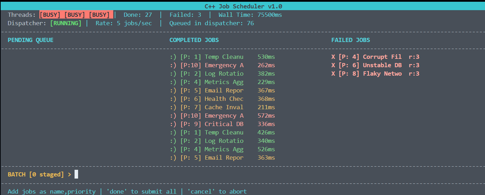

# C++ Job Scheduler

A multi-threaded job scheduling system built in C++ featuring a priority queue, thread pool, rate-limited dispatcher, exponential backoff retry, persistent logging, and a live ncurses terminal UI.



---

## Features

- **Priority Queue** — jobs execute highest priority first (1–10 scale)
- **Thread Pool** — configurable worker threads with mutex-protected concurrent execution
- **Job Dispatcher** — dedicated dispatch thread with rate limiting and pause/resume control
- **Exponential Backoff Retry** — failed jobs retry up to 3 times (500ms → 1000ms → 2000ms)
- **Batch Mode** — stage multiple jobs and submit them simultaneously
- **Live Terminal UI** — real-time ncurses interface with pending, completed, and failed panels
- **Persistent Logger** — timestamped log of every job event with session summary
- **Benchmark Harness** — automated performance measurement across job counts and thread counts

---

## Architecture

```
Input (main.cpp)
      │
      ▼
 Dispatcher          ← rate limiting, pause/resume, dedicated thread
      │
      ▼
 Thread Pool         ← priority queue, mutex, condition variables
  ├── Worker 0
  ├── Worker 1
  └── Worker 2
      │
      ├──► UI         ← ncurses panels, real-time updates
      └──► Logger     ← timestamped file, session summary
```

### Component Responsibilities

| Component | Responsibility |
|---|---|
| `job.h` | Job struct with priority, retry fields, task lambda |
| `thread_pool.h` | Worker threads, priority queue, mutex, retry with exponential backoff |
| `dispatcher.h` | Rate limiting, pause/resume, decouples submission from execution |
| `ui.h` | NCurses terminal UI — pending, completed, failed panels |
| `logger.h` | Append-only log file with timestamps and session summary |
| `benchmark.cpp` | Headless stress test — throughput and latency measurement |

---

## Benchmark Results

Benchmarked with job durations randomized 50–300ms, fixed seed for reproducibility.

```
===========================================================================
          C++ Job Scheduler — Benchmark Results
===========================================================================
Jobs    Threads   Wall Time     Throughput    Avg Latency   Min         Max
===========================================================================
100     1         18391ms       5 j/s         183ms         54ms        297ms
100     3         5747ms        17 j/s        171ms         57ms        299ms
100     6         3036ms        32 j/s        175ms         52ms        299ms
===========================================================================
500     1         86468ms       5 j/s         172ms         50ms        299ms
500     3         29420ms       16 j/s        176ms         50ms        299ms
500     6         14455ms       34 j/s        172ms         50ms        299ms
===========================================================================
1000    1         172168ms      5 j/s         172ms         50ms        299ms
1000    3         58783ms       17 j/s        176ms         50ms        299ms
1000    6         29212ms       34 j/s        174ms         50ms        299ms
===========================================================================

  Speedup vs single thread:
    3 threads → 3.20x  (100 jobs) | 2.94x (500 jobs) | 2.93x (1000 jobs)
    6 threads → 6.06x  (100 jobs) | 5.98x (500 jobs) | 5.89x (1000 jobs)
```

**Near-linear scaling** with minimal lock contention — 6 threads achieve ~6x speedup across all workload sizes.

---

## Getting Started

### Prerequisites

```bash
# Linux / WSL / GitHub Codespaces
sudo apt-get install libncurses5-dev libncursesw5-dev
```

### Build

```bash
# Build both binaries
make all

# Or build individually
make scheduler    # interactive UI
make benchmark    # headless benchmark
```

### Run

```bash
# Interactive scheduler
make run

# Benchmark harness
make bench
```

---

## Usage

### Commands

| Command | Description |
|---|---|
| `name,priority` | Submit a single job (e.g. `cleanup,5`) |
| `demo` | Submit 8 sample jobs at once |
| `fail` | Submit 3 jobs that will fail and retry |
| `batch` | Enter batch mode — stage multiple jobs |
| `done` | Submit all staged batch jobs simultaneously |
| `cancel` | Discard staged batch jobs |
| `pause` | Pause the dispatcher |
| `resume` | Resume the dispatcher |
| `rate N` | Set dispatch rate (e.g. `rate 3` = 3 jobs/sec) |
| `q` | Quit |

### Batch Mode Example

```
Submit job > batch
BATCH [0 staged] > DB Backup,9
BATCH [1 staged] > Alert,10
BATCH [2 staged] > Cleanup,3
BATCH [3 staged] > done
3 jobs submitted to dispatcher!
```

### Retry Behavior

Jobs marked as failing automatically retry with exponential backoff:

```
Attempt 1 fails → wait 500ms  → retry
Attempt 2 fails → wait 1000ms → retry
Attempt 3 fails → wait 2000ms → retry
Attempt 4 fails → FAILED (appears in right panel)
```

---

## Log File

Every session appends to `scheduler.log`:

```
========================================
  Scheduler Session Started
========================================
[2026-05-22 11:49:49] SUBMITTED  | P:10 | Emergency Alert
[2026-05-22 11:49:49] COMPLETED  | P:10 | Emergency Alert       | 383ms
[2026-05-22 11:49:50] RETRY      | P: 8 | Flaky Network Call    | attempt 1 | backoff 500ms
[2026-05-22 11:49:52] FAILED     | P: 8 | Flaky Network Call    | retries: 3
[2026-05-22 11:49:55] DISPATCHER | RATE CHANGED -> 3 jobs/sec
========================================
  Session Summary
  Total submitted  : 13
  Completed        : 13
  Failed           : 0
  Avg finish time  : 409.5ms
  Session duration : 26.9s
========================================
```

---

## Technical Highlights

**Why condition variables over busy-waiting?**
Worker threads and the dispatcher thread sleep via `std::condition_variable::wait()` — consuming zero CPU when idle. Busy-waiting would waste an entire core spinning.

**Why FIFO in the dispatcher but priority queue in the pool?**
The dispatcher owns flow control — it doesn't care about priority, only rate. The pool owns execution order — it sorts by priority so the most urgent job always runs next. Single responsibility per component.

**Why near-linear speedup?**
Jobs are independent with no shared state during execution. The mutex only protects the queue during the brief job-pickup phase — threads spend >99% of their time executing, not waiting for locks.

---

## Project Structure

```
cpp-job-scheduler/
├── src/
│   ├── job.h           # Job struct
│   ├── thread_pool.h   # Thread pool with retry logic
│   ├── dispatcher.h    # Rate-limited job dispatcher
│   ├── ui.h            # NCurses terminal UI
│   ├── logger.h        # Persistent job logger
│   ├── main.cpp        # Entry point — wires all components
│   └── benchmark.cpp   # Headless benchmark harness
├── scheduler.log       # Auto-generated session log
├── screenshot.png      # Terminal UI screenshot
├── Makefile
└── README.md
```

---

## Planned Features

- Job cancellation — cancel pending jobs before execution
- Job dependencies — job B starts only after job A completes
- Job timeout — kill jobs exceeding a time limit
- CSV export of benchmark results

---

## Skills Demonstrated

`C++17` `Multithreading` `std::mutex` `std::condition_variable` `Priority Queue` `Lambda Functions` `RAII` `NCurses` `System Design` `Performance Benchmarking`